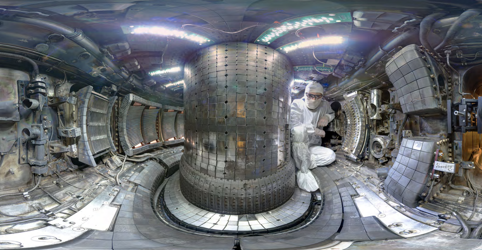

I am a postdoctoral researcher at the Max-Planck-Institut für Plasmaphysik in Garching, Germany, where I focus on plasma spectroscopy and interpretation of divertor measurements at the ASDEX Upgrade tokamak. Part of my work is also on the W7-X optimized stellarator, in Greifswald, northern Germany. I have been working on tokamak ''negative triangularity'' scenarios on AUG, DIII-D, and TCV, most lately as one of the European Scientific Coordinators within the EuroFusion RT07 task force.

I am a graduate of the MIT Plasma Science & Fusion Center, where I did my PhD research on particle transport and spectroscopy in magnetic confinement fusion devices, particularly the Alcator C-Mod and DIII-D tokamaks in the USA. 

Bringing the power of the stars to Earth, as fusion research aims to do, is a unique multi-disciplinary challenge, with elements of plasma, atomic and engineering physics. This mix is what fascinates me the most about fusion and the passionate people who try to bring on the energy revolution. 

Photo: interior of Alcator C-Mod. Credit: Bob Mumgaard.

What is in this website
=======================
This website collects information about my research, academic path and outreach activity. Please get in touch for any questions!

Latest News
===========
* Sep 26, 2022: my work on particle transport in DIII-D diverted negative triangularity experiments has been accepted in Plasma Physics & Controlled Fusion (see the paper [here](https://iopscience.iop.org/article/10.1088/1361-6587/ac94f6/pdf)).
* Oct 21, 2021: my latest C-Mod work on neutrals and impurity transport is now published in Nuclear Fusion (see [here](https://iopscience.iop.org/article/10.1088/1741-4326/ac32f2/pdf)). Keywords: Bayesian inference, impurity transport, neutrals, x-ray and ultra-violet spectroscopy. Studies of C-Mod L-, EDA H- and I-mode discharges.
* Oct 14, 2021: the paper "The Very High-n Rydberg Series of Ar16+ in Alcator C-Mod Tokamak Plasmas" has been published in the Journal of Physics B: Atomic, Molecular and Optical Physics (find it [here](https://iopscience.iop.org/article/10.1088/1361-6455/ac2722)). I really enjoyed contributing to this work led by John Rice at MIT! 
* Oct 12, 2021: a short paper presenting Aurora, a modern package for particle transport, neutrals and radiation in magnetically-confined plasmas (tokamaks and stellarators) is finally available on the PPCF journal website: [F Sciortino et al 2021 Plasma Phys. Control. Fusion 63 112001](https://iopscience.iop.org/article/10.1088/1361-6587/ac2890)

In the media
============
* March 3, 2022, ["Star power"](https://www.mghpcc.org/star-power/), a short article by H. Hill on my PhD work, has been published on the MGHPCC computing cluster blog.
* Decemeber 18, 2020, ["Three Questions: Francesco Sciortino on his HTPD invited talk" - MIT PSFC interview](https://www.psfc.mit.edu/news/2020/three-questions-francesco-sciortino-on-his-htpd-invited-talk)
* December 14, 2018, ["Organizing the scientific life: PhD candidate works behind the scenes to create learning opportunities for peers and the general public" - MIT PSFC interview](https://www.psfc.mit.edu/news/2018/francesco-sciortino-organizing-the-scientific-life)
* ["Un dottorato al MIT per la fusion nucleare" - Micron](https://www.rivistamicron.it/approfondimenti/un-dottorato-al-mit-per-la-fusione-nucleare/)
* ["Why organizing a scientific conference can produce huge benefits" - Nature](https://www.nature.com/articles/d41586-018-05714-9?utm_source=fbk_nnc&utm_medium=social&utm_campaign=naturenews&sf193884577=1)

Some useful links
=================

* Website of the [Max Planck Institute for Plasma Physics, (MPI-IPP)](https://www.ipp.mpg.de/)
* Website of the [MIT Plasma Science & Fusion Center](https://www.psfc.mit.edu/)
* Website of [MIT](https://www.mit.edu/)

Here is a collection of articles, poems and pages of various kinds that, for one reason or another, I have found interesting. 

* P.W. Anderson, Science, 1972, Vol. 177, Issue 4047, pp. 393-396, DOI: 10.1126/science.177.4047.393
  ["More is different"](https://cse-robotics.engr.tamu.edu/dshell/cs689/papers/anderson72more_is_different.pdf)
  
  This article masterfully exposes how I think about "intensive" vs. "extensive" research, the "reductionist" hypothesis, and why complex scientific disciplines like plasma physics are so interesting.
  
* Eugenio Montale, ["I limoni"](https://www.libriantichionline.com/divagazioni/eugenio_montale_limoni_1925)

* Byers, J. ["The physics of data"](https://rdcu.be/cHcKJ). Nature Phys 13, 718–719 (2017). "Physicists are accustomed to dealing with large datasets, yet they are fortunate in that the quality of their experimental data is very good. The onset of big data has led to an explosion of datasets with a far more complex structure — a development that requires new tools and a different mindset."

* Interesting visualization of research impact of institutions around the world: [Excellence Maps](https://www.excellencemapping.net/#/explore?id=24696&lng=-122&lat=38&z=7&f=0&c=A_BASE&a=All&s=0&m=Highly+cited+papers)

* Simply wonderful: "We consider all the 175 Roman emperors and propose a new power-law model with change points to predict the time-to-violent-death of the Roman emperors." [Ramos et al. 2021 - Power laws in the Roman Empire: a survival analysis, R. Soc. open sci.8:210850.210850](https://royalsocietypublishing.org/doi/10.1098/rsos.210850) (thanks to JER for pointing this out)
