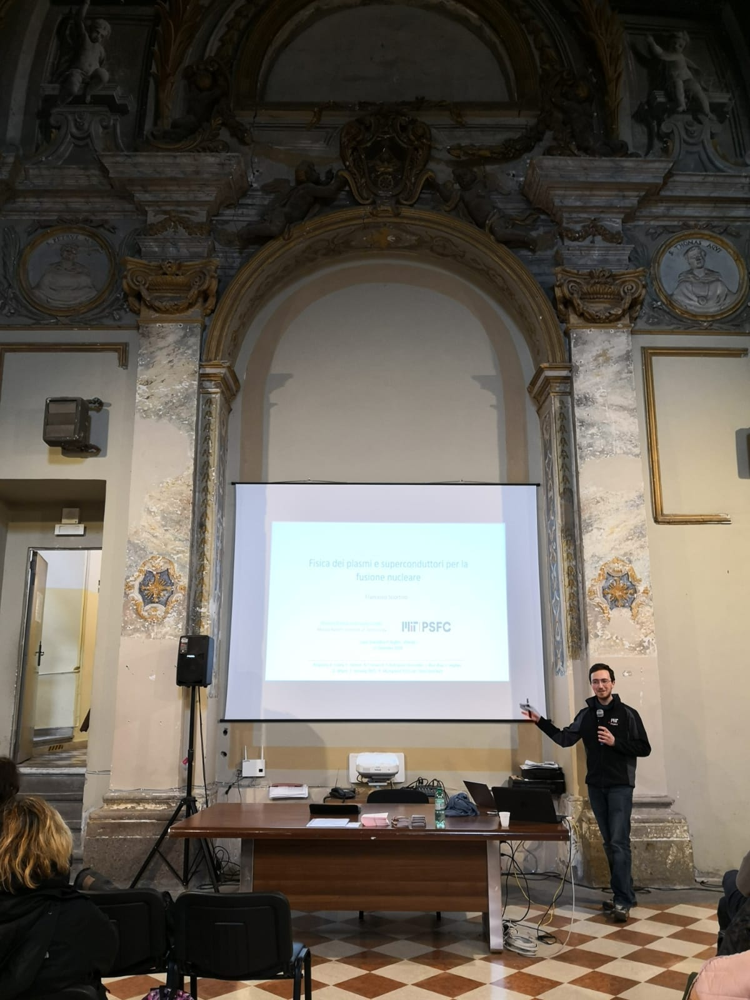

If you are interested in learning more about my research, or fusion energy more generally, please do get in touch! I am happy to answer questions, both from students and educators.

A few pictures of past outreach activities are below. Faces (except my own) are intentionally obscured in photographs. 

Image above: giving a tour of Alcator C-Mod during my PhD at MIT.

Image above: outreach activity with local schools in Portland, Oregon (USA), at the APS-DPP conference in 2019.

Image above: explaining the principles of plasma creation and confinement in a simple linear device at the MIT Energy Night in 2018.

Image above: talk to students of the Ruffini Scientific High School, where I once studied myself, in fall 2018. Not everyone gets to talk about fusion in an old church with wall frescos...
