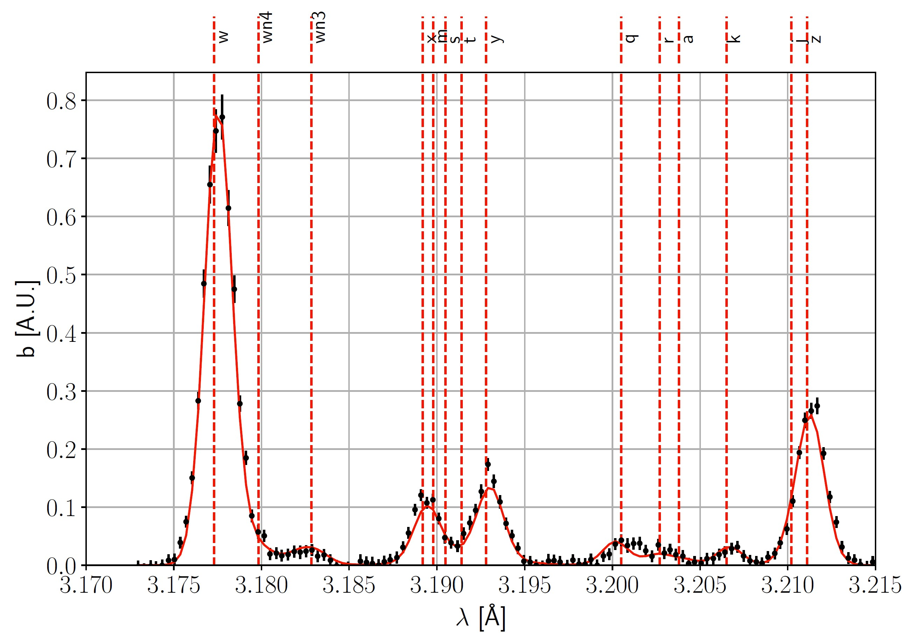

My graduate school research has focused on particle transport in tokamak plasmas. I have worked on the analysis of Alcator C-Mod and DIII-D experiments, developing Bayesian inference frameworks to compare particle transport coefficients between theoretical calculations and experimental modeling.

An outcome of my graduate research has been the public release of the Aurora package for particle transport and radiation modeling for fusion plasmas, which has [its own website](https://aurora-fusion.readthedocs.io/en/latest/).

Before coming to MIT, I spent some time doing research at
* the Magnetic Reconnection eXperiment (MRX) at the Princeton Plasma Physics Laboratory
* the Mega Ampere Generator for Plasma Implosion Experiments (MAGPIE) at Imperial College London
* the TCV tokamak at Ecole Polytechnique Federale de Lausanne (EPFL)

Image: reconstruction of the calcium K-alpha spectrum measured by the X-ray Imaging Crystal Spectroscopy (XICS) diagnostic on Alcator C-Mod, using the inference framework that I developed during my PhD thesis, here applied for an I-mode discharge.
